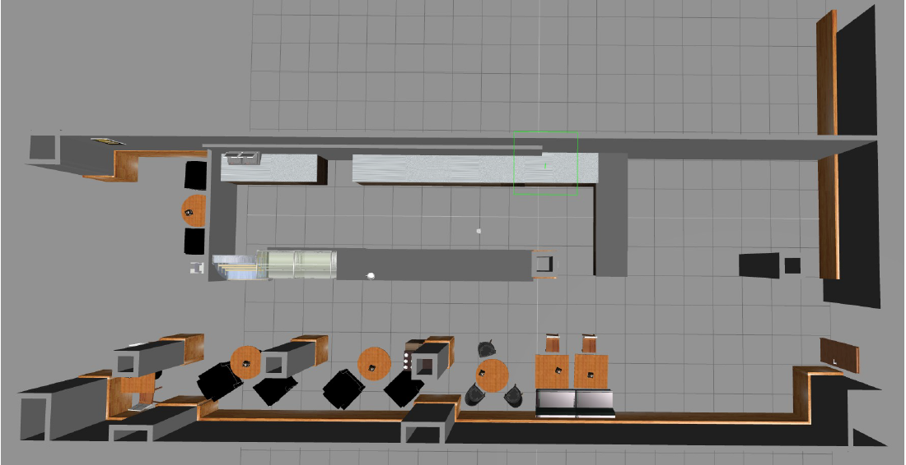
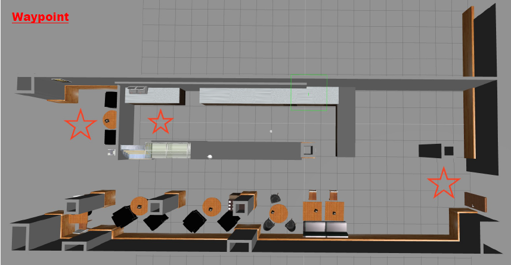
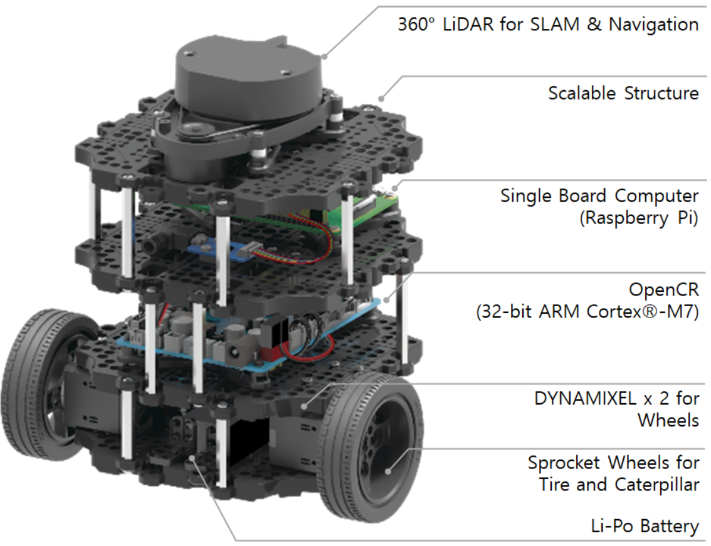
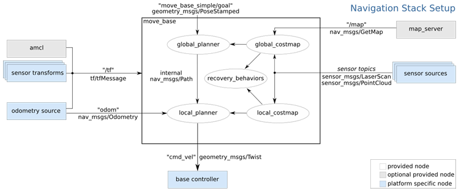

# ROS Navigation Turtulebot3 Burger
**Version 1.0.0**

Authors:
- Azadeh Hadadi (a.hadadi1363@gmail.com)
- Jue Wang (834185446@qq.com)

**Table-of-contents**
- [Project Description](#projectDEscription)
- [Hardware Component](#hardwareComponent)
- [Navigation](#navigation)
- [Procedure](#procedure)
- [Discussion](#discussion)
  - [Mapping](#mapping)
  - [Localization](#localization)
  - [Path Planning ](#pathPlanning )
  - [Avoid Obstacles](#avoidObstacles)
  - [Follow Waypoints](#FollowWaypoints)
  
  ## Project Description

This project addressed the problem of ROS Navigation. Turtlebot3 Burger is considered as the objective robot model. A cafeteria map is defined as a target map which is shown in Figure1.
A clean map of the full cafeteria should be created and the robot should localize itself in the environment. A goal position will be defined in the map which the robot should be taken through from its initial position to it. As is displayed in Figure1, there are some obstacles in the map. Meanwhile path planning, Turtulebot3 should avoid these obstacles. As the last step, three waypoints are considered in the map as displayed in Figure2 which Turtulebot should follow.

  

    <em>Fig. 1: target map</em>

  

    <em>Fig. 2: objective waypoints</em>

Final results for the project are recorded on video and can be accessed on YouTube via this link :

## Hardware Component
The target mode is Turtlebot Burger. Turtulebot3 which is available in two models, i.e. burger and waffle, is low-cost. It has a personal robot kit with open-source software and hardware. Moreover, this model which is the world’s most popular ROS platform, is modular, compact and customizable. 360° LiDAR of Burger, as the laser sensor is a 2D laser scanner that collects a set of data around the robot to use for SLAM (Simultaneous Localization and Mapping). Semiconductor Laser Diode (λ=785nm) is Its light source. The Distance range is 120 ~ 3,500mm. Additionally, its angular Range and angular Resolution are 360° and 1° respectively.

  

    <em>Fig. 3: Turtlebot Burger model</em>

## Navigation
The main aim of the ROS navigation package is to move a robot from the start position to the goal position, without making any collision with the environment. The ROS Navigation package comes with an implementation of several navigation related algorithms which can easily help implement autonomous navigation in the mobile robots. Navigation Stack which is shown in Figure 4, takes in current location of the robot, the goal pose, the Odometry data of Robot (wheel encoders etc) and data from a sensor as an input, and outputs the necessary velocity commands and forward them to the mobile base in order to move the robot to the designated goal.

  

    <em>Fig. 4: Navigation Stack</em>

## Procedure
The source package is **ros_project** including **launch**, **params** and **maps** subdirectories. ros_project package is used as the main package which includes the required  launch files to do the steps. 
The first step for navigation is creating a 2D map using the data from the laser and the pose of the robot when it moves around the environment. **start_mapping.launch** is created in the **launch** folder to start **slam_gmapping** node. To visualize the navigation process, **RVIZ** tool is applied. So, In a new web shell, we run the below command which launches a predefined configuration of RVIZ for Mapping. 

`rosrun rviz rviz -d rospack find turtlebot3_slam/rviz/turtlebot3_slam.rviz`

Turtlebot is controlled by teleoperation to make it move through the environment in order to build the map using 360° LiDAR. To launch the teleoperation of Turtlebot3, we run the command in a new web shell:  

`roslaunch turtlebot3_teleop turtlebot3_teleop_key.launch`
