# ROS Navigation using Turtulebot3 Burger
**Version 1.0.0**

ROS Navigation stack is a powerful toolbox to path planning and Simultaneous Localization and Mapping (SLAM). This report is a technical document for ROS Navigation Using Turtlebot3 Burger. The **Construct Web Platform** is used as a simulator.

Supervisor:   
- Professor Ralph SEULIN

Authors:
- Jue Wang (Jue_Wang@etu.u-bourgogne.fr)
- Azadeh Hadadi (Azadeh_Hadadi@etu.u-bourgogne.fr)

**Table of Contents**
- [Project Description](#Project-Description)
- [Hardware Component](#hardware-Component)
- [Navigation](#navigation)
- [Procedure](#procedure)
- [Discussion](#discussion)
  - [Mapping](#mapping)
  - [Localization](#localization)
  - [Path Planning ](#path-Planning )
  - [Avoid Obstacles](#avoid-Obstacles)
  - [Follow Waypoints](#Follow-Waypoints)
 - [Material Video](#material)
 - [References](#references)
  
## Project Description

This project addressed the problem of ROS Navigation. Turtlebot3 Burger is considered as the objective robot model. A cafeteria map is defined as a target map which is shown in Figure1.
A clean map of the full cafeteria should be created and the robot should localize itself in the environment. A goal position will be defined in the map which the robot should be taken through from its initial position to it. As is displayed in Figure1, there are some obstacles in the map. Meanwhile path planning, Turtulebot3 should avoid these obstacles. As the last step, three waypoints are considered in the map as displayed in Figure2 which Turtulebot should follow.

  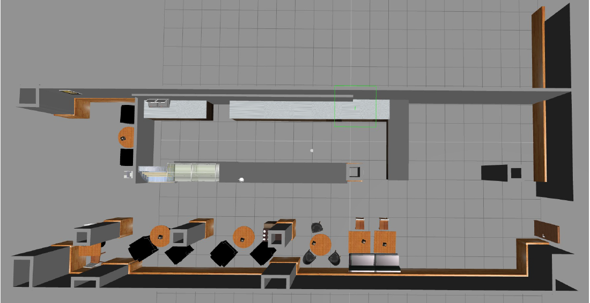

    <em>Fig. 1: target map</em>

  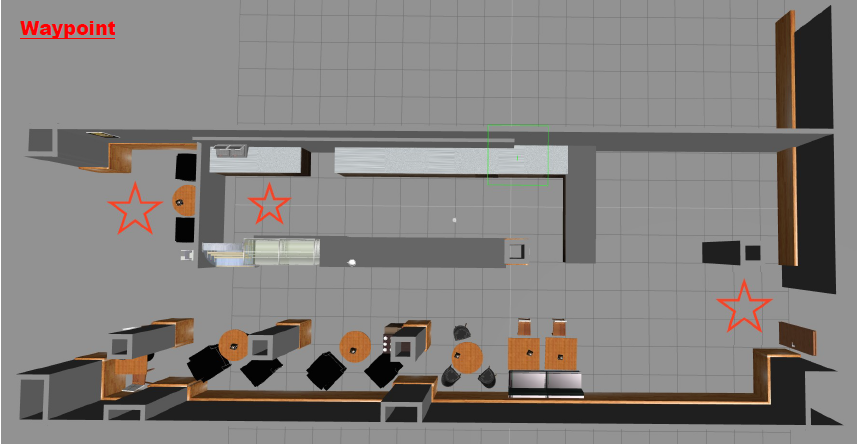

    <em>Fig. 2: objective waypoints</em>

Final results for the project are recorded on video and can be accessed on YouTube via this link :

## Hardware Component
The target mode is Turtlebot Burger. Turtulebot3 which is available in two models, i.e. burger and waffle, is low-cost. It has a personal robot kit with open-source software and hardware. Moreover, this model which is the world’s most popular ROS platform, is modular, compact and customizable. 360° LiDAR of Burger, as the laser sensor is a 2D laser scanner that collects a set of data around the robot to use for SLAM (Simultaneous Localization and Mapping). Semiconductor Laser Diode (λ=785nm) is Its light source. The Distance range is 120 ~ 3,500mm. Additionally, its angular Range and angular Resolution are 360° and 1° respectively.

  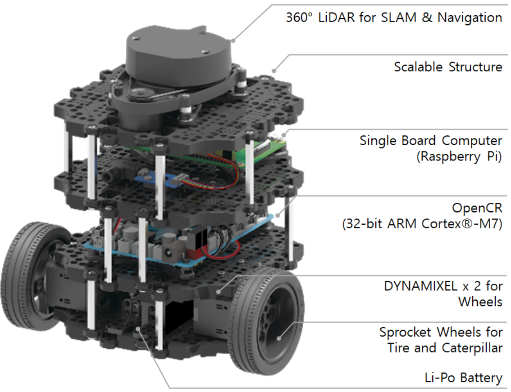

    <em>Fig. 3: Turtlebot Burger model</em>

## Navigation
The main aim of the ROS navigation package is to move a robot from the start position to the goal position, without making any collision with the environment. The ROS Navigation package comes with an implementation of several navigation related algorithms which can easily help implement autonomous navigation in the mobile robots. Navigation Stack which is shown in Figure 4, takes in current location of the robot, the goal pose, the Odometry data of Robot (wheel encoders etc) and data from a sensor as an input, and outputs the necessary velocity commands and forward them to the mobile base in order to move the robot to the designated goal.

  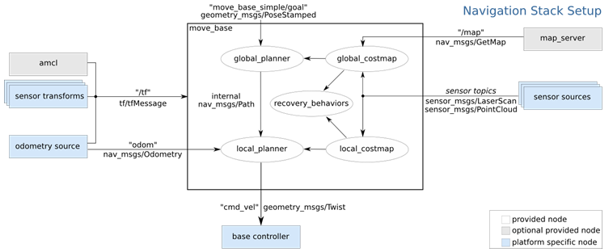

    <em>Fig. 4: Navigation Stack</em>

## Procedure
The source package is **ros_project** including **launch**, **params** and **maps** subdirectories. ros_project package is used as the main package which includes the required  launch files to do the steps. 
The first step for navigation is creating a 2D map using the data from the laser and the pose of the robot when it moves around the environment. **start_mapping.launch** is created in the **launch** folder to start **slam_gmapping** node. To visualize the navigation process, the **Rvis** tool is applied. So, In a new web shell, we run the below command. 

`rosrun rviz rviz`

Then we choose **our_config.rviz** for Mapping. Figure 5 shows all the displays we need to add.

  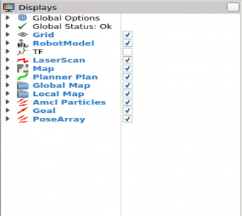

    <em>Fig. 5: Rviz display</em>

Turtlebot is controlled by teleoperation to make it move through the environment in order to build the map using 360° LiDAR. To launch the teleoperation of Turtlebot3, we run the command in a new web shell: 

`roslaunch turtlebot3_teleop turtlebot3_teleop_key.launch`

We also tried using this command in the web shell to make the robot move around the environment:

`rostopic pub /cmd_vel [TAB][TAB]`

Figure 6 shows the information of velocity to be modified.

  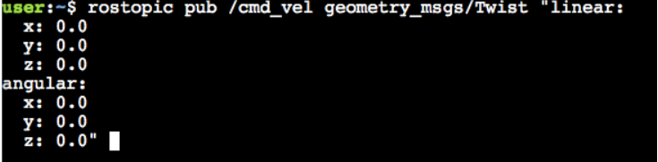

    <em>Fig. 6: Control the velocities of the robot using **/cmd_vel** topic</em>

Then we modify the linear velocity in x and angular velocity in z to make it move, but every time we want to change the velocity, we should ctrl+c to kill the last command and run the command again to modify the corresponding velocity.

The generated maps are saved in the **maps** folder using **map_server**: 
* our_map.pgm
* our_map.yaml

**start_localization.launch** and **start_navigation.launch** are added in the **launch** folder to start the localization node and move the robot around to see its pose and start the **move_base** node to do path planning, respectively. We need to set all the parameters be called by move_base node in the **params** folder including:
* **costmap_common_params_burger.yaml**
* **local_costmap_params.yaml**
* **global_costmap_params.yaml**
* **move_base_params.yaml**
* **dwa_local_planner_params.yaml**

To start localization the below command is applied:

`roslaunch ros_project start_localization.launch`

In the path planning step, **2D Pose Estimate** and **2D Nav Goal** tools in Rviz are used to set the initial position of the robot and send the goal to the robot, respectively. During the path planning, Turtulebot will avoid the obstacles in the path. It will be started by running this command:

`roslaunch ros_project start_navigation.launch`

To follow the waypoints, follow_waypoints package is useds. This package basically tracks the Estimate pose that is placed in RVIZ and stored. Then these positions should be published in a topic that starts sending them to the movebase system. So, follow_waypoints is gotten from the github and compiled:

`cd ~/catkin_ws/src`

`git clone https://github.com/danielsnider/follow_waypoints.git`

Or you can directly download from our repository, we have already prepared this package.

`roscd`

`cd ..`

`catkin_make`

`source devel/setup.bash`    (on every shell)

 The next step is to start the waypoint server. This server will listen to publications into the topic **/initialpose** and store those poses until it is instructed to send them to **move_base** to be executed. 
 
`roslaunch follow_waypoints follow_waypoints.launch`

In RVIZ, a PoseArray element which is named WayPoints is added and shows all the waypoints are set since now. It subscribed to the topic **/waypoints**. The last step is publishing in the topic **/path_ready** to start sending waypoints to the movebase.

`rostopic pub /path_ready std_msgs/Empty -1` 

## Discussion
### Mapping

  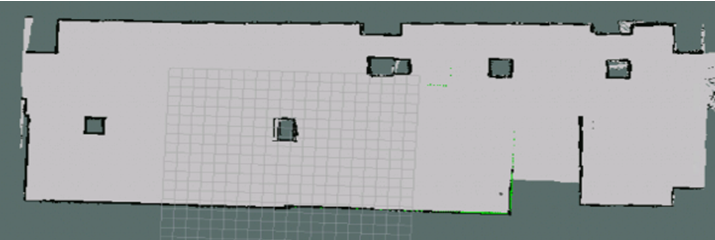

    <em>Fig. 7: Mapping process at a linear speed of 0.1m/s</em>

It can be seen from Figure 7 that at the beginning we didn't know how to control the speed of the robot well to build a map. We used a linear velocity of 0.1m/s to control the movement. Part of the reason is that due to network delays, the maps created are not accurate. So we must constantly move through the scene to build a somewhat accurate and complete map.

  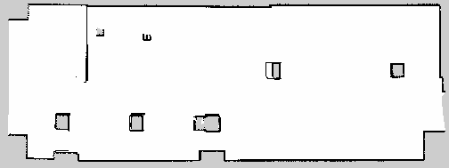

    <em>Fig. 8: PGM established and saved at a linear velocity of 0.05m/s</em>

Figure 8 is the map we created and saved by controlling the robot to move in the scene at a linear speed of 0.05m/s. After saving, there are two files, our_map.yaml and our_map.pgm.

## Localization

  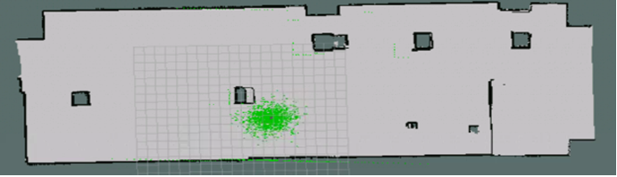

    <em>Fig. 9: Initial pose estimation during localization process</em>

After launching the start_localization.launch file, we first need to give an initial pose, as Figure 9 shown, you can see the green particle cloud is the probability of pose. Then we let the robot move in the scene and use AMCL to automatically locate the robot.

  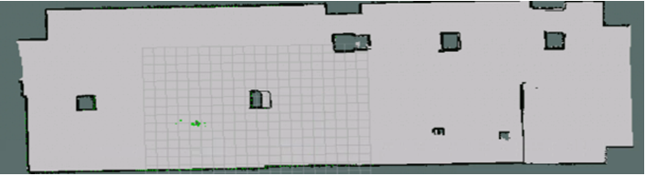

    <em>Fig. 10: Pose estimation after localization process</em>

It can be seen from Figure 10 that after automatic localization, the green particle cloud becomes concentrated. The more concentrated the particle cloud, the more accurate the robot's pose estimation and the more accurate the localization.

## Path Planning

  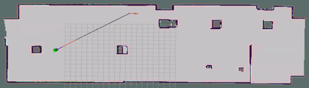

    <em>Fig. 11: Path Planning</em>

By launching the start_navigation.launch file, publishing the goal point, the robot automatically plans the path, and starts to go to the goal point. As we can see from Figure 11, the black line is the global planning path, and the red part is the local planning path.

## Avoid Obstacles

  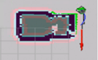

    <em>Fig. 12: Avoid Obstacles</em>

Obstacles will be encountered during navigation. As shown in Figure 12, at the corners, the robot needs to avoid collisions, and it will automatically detect the distance.

## Follow waypoints

  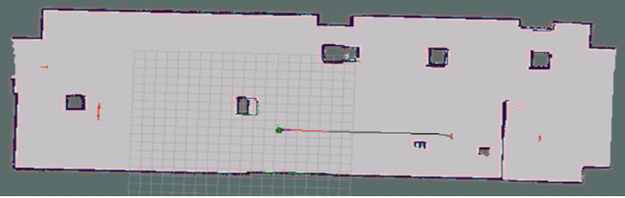

    <em>Fig. 13: From initial pose to first waypoint</em>

  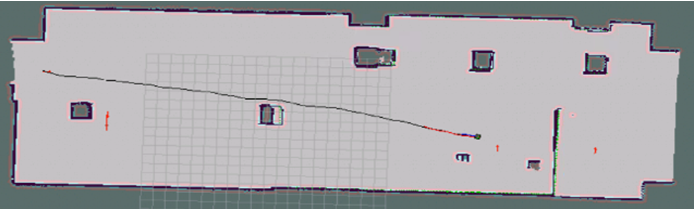

    <em>Fig. 14: From first waypoint to second waypoint</em>

  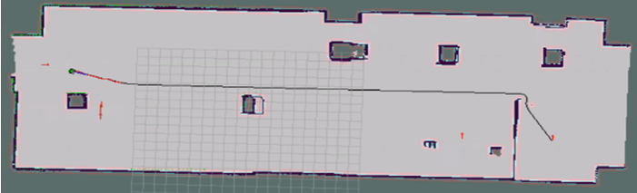

    <em>Fig. 15: From second waypoint to third waypoint</em>

  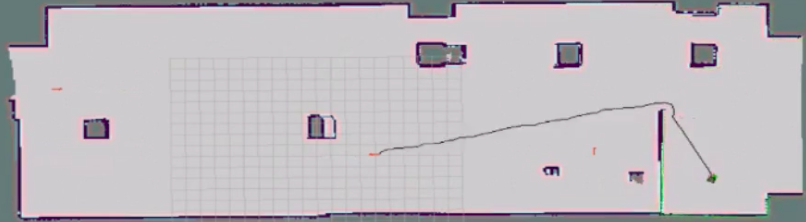

    <em>Fig. 16: From third waypoint to initial pose</em>

Figures 13 to 16 show the process of following the waypoints. Since we are using the follow_waypoints package, we start from the initial pose, and finally return to the initial pose following three waypoints.

## Material

#### Video in Construct web platform (https://www.youtube.com/watch?v=BmDgy7q8rPo&feature=youtu.be)
  [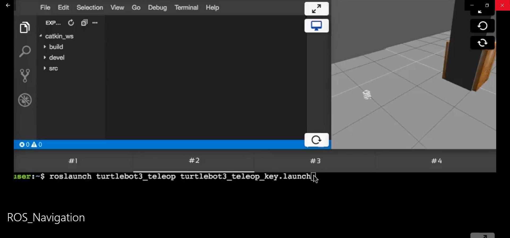](https://youtu.be/BmDgy7q8rPo)

## References
[1]Xiang Gao, Tao Zhang, Yi Liu, and Qinrui Yan. 14 Lectures on Visual SLAM: From Theory
to Practice. Publishing House of Electronics Industry, 2017.

[2]Guillermo Castillo (Wei Zhang), Department of Electrical and Computer Engineering , Ohio
State University: ROS TUTORIAL 3, 2018
